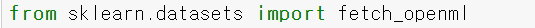
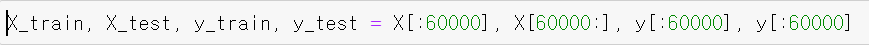
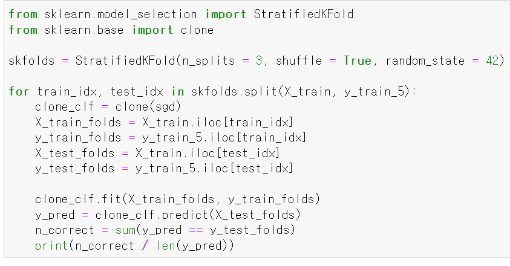
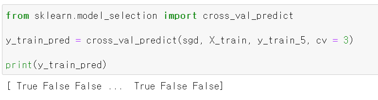
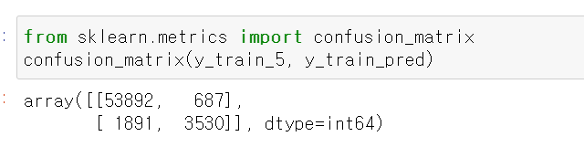
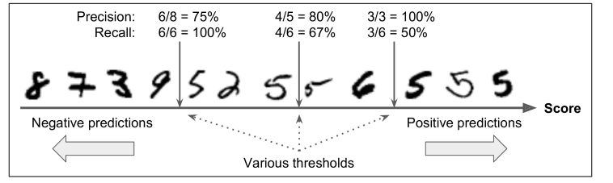
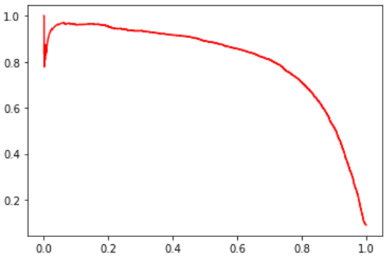
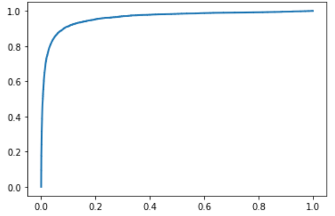

# 3. 분류

## 3.1 MNIST 
- 70000개의 작은 숫자 이미지로 구성 되어있고, 각 이미지에는 어떤 숫자를 나타내는지 레이블 되어있다.
- 
    - 사이킷런에서 MNIST를 읽어 들일 수 있다.
    - 사이킷런에서 읽어들인 데이터셋들은 일반적으로 비슷한 딕셔너리 구조를 가지고 있는데, 데이터셋을 설명하는 'DESCR' 키, 샘플이 하나의 행, 특성이 하나릐 열로 구성된 배열을 가진 'data' 키, 레이블 배열을 담은 'target' 키 등으로 구성되어 있다.

- MNIST 예제에서도 마찬가지로 데이터를 자세히 조사하기 전에 항상 테스트 세트를 만들고 따로 떼어놓아야 하지만, MNIST 데이터셋은 이미 훈련 세트(60000개,10000개)로 나눠져 있어 아래와 같이 불러올 수 있다. 

## 3.2 이진 분류기 훈련
- 이진 분류기의 예시는 5만 식별하여 '5'와 '5가 아님' 두 개의 클래스를 구분하는 분류기이다. 

## 3.3 성능 측정
### 3.3.1 교차 검증을 사용한 정확도 측정
- 교차 검증 구현

    - StratifiedKFold는 클래스별 비율이 유지되도록 폴드를 만들기 위해 계층적 샘플링을 수행한다.
    - 매 반복에서 분류기 객체를 복제하여 훈련 폴드로 훈련시키고 테스트 폴드로 예측을 만든다.
    - 마지막으로 올바른 예측의 수를 세고, 정확한 예측의 비율을 출력한다.

- k-겹 교차 검증은 훈련 세트를 k개의 폴드로 나누고, 각 폴드에 대해 예측을 만들고 평가하기 위해 나머지 1개의 폴드로 훈련시킨 모델을 사용한다.

### 3.3.2 오차 행렬
- 분류기의 성능을 평가하는 더 좋은 방법은 오차행렬이다.
- 오차행렬의 기본적인 아이디어는 클래스 A의 샘플이 클래스 B로 분류된 횟수를 세는 것이다.
- 오차행렬을 만들려면 실제 타깃과 비교할 수 있도록 먼저 예측값을 만들어야 한다.

- 교차검증의 cross_val_predict() 함수는 k-겹 교차 검증을 수행하지만, 평가 점수를 반환하지 않고 각 테스트 폴드에서 얻은 예측을 반환한다.

- 실제 타깃 클래스와 예측 클래스를 confusion_matrix()에 넣고 오차행렬을 만들 수 있다.

    - 오차 행렬의 행은 실제 클래스를, 열은 예측한 클래스를 나타낸다.
    - 행렬의 첫번째 행은 '5가 아닌' 이미지에 대한 것으로 53892개를 '5가 아님'으로 정확히 분류했고 (TN) 나머지 687개는 '5'라고 잘못 분류했다(FP).
    - 두번째 행은 '5' 이미지에 대한 것으로 1891개를 '5가 아님'으로 잘못 분류했고 (FN), 나머지 3530개를 정확히 '5'라고 분류했다 (TP)

- 오차 행렬이 많은 정보를 제공하지만 더 요약된 지표로는 정밀도와 재현율이 있다.

### 3.3.3. 정밀도와 재현율
- 정밀도는 양성 예측의 정확도 이다.
- 정밀도 = TP/(TP + FP)
- 정밀도는 재현율(recall) 이라는 또 다른 지표와 같이 사용하는 것이 일반적인데, 재현율은 분류기가 정확하게 감지한 양성 샘플의 비율로 민감도(sensitivity) 또는 TPR이라고도 한다.
- 재현율 = TP/(TP+FN)

- 정밀도와 재현율을 F1 score 이라는 하나의 숫자로 표현할 수 있다. F1 score은 정밀도와 재현율의 조화평균을 의미한다.
- F1 = 2 x (정밀도 x 재현율) / (정밀도 + 재현율)
- 정밀도와 재현율이 비슷한 분류기에서는 F1 점수가 높지만, 상황에 따라 정밀도가 중요할 수도 있고 재현율이 중요할 수도 있다.
- 정밀도가 높으면 재현율이 낮아지고, 정밀도가 낮으면 재현율이 높아지므로, 정밀도와 재현율은 트레이드 오프 관계에 있다.

### 3.3.4 정밀도/재현율 트레이드오프

 - 세개의 결정 임계값 중 가운데 화살표라고 가정하면, 임계값 오른쪽에 4개의 진짜 양성(실제 숫자 5)과 하나의 거짓 양성(실제 숫자 6)이 있기 때문에 정밀도는 80%이다. 하지만 실제 숫자 5는 6개고 분류기는 4개만 감지했으므로 재현율은 67%이다.
 - 임계값을 맨 오른쪽이라 가정하면 거짓 양성 (숫자 6)이 진짜 음성이 되어 정밀도가 높아진다, 하지만 진짜 양성 하나가 거짓 음성이 되었으므로 재현율이 50%로 줄어든다.
 - 즉, 임계값을 높이면 재현율이 줄어든다.

 - 좋은 정밀도/재현율 트레이드오프를 선택하는 방법은 아래 그림처럼 재현율에 대한 정밀도 곡선을 그리는 것이다.
 
 - 재현율 80% 근처에서 정밀도가 급격하게 줄어들기 시작한다. 이 하강점 직전을 정밀도/재현율 트레이드오프로 선택하는 것이 좋다. 이러한 선택은 프로젝트에 따라 달라진다.
 
 ### ROC 곡선
 - ROC 곡선도 이진 분류에서 널리 사용되는 도구이다.
 - 정밀도/재현율 곡선과 매우 비슷하지만, ROC 곡선은 정밀도에 대한 재현율 곡선이 아니라, FPR에 대한 TPR의 곡선이다.
 - FPR은 양성으로 잘못 분류된 음성 샘플의 비율이고, 이는 1에서 음성으로 정확히 분류된 음성 샘플의 비율인 TNR을 뺀값이다.
 - TNR은 특이도라고도 하며, ROC 곡선은 민감도(재현율)에 대한 1-특이도 그레프이다.

 - 이 그래프는 ROC 곡선의 예시이다.
 
- ROC 곡선에서도 트레이드오프가 존재하는데, TPR(재현율)이 높을수록 분류기가 만드는 거짓 양성인 FPR이 늘어난다.
- y=x 그래프는 완전한 랜덤 분류기의 ROC 곡선을 뜻한다. 좋은 분류기는 y=x에서 최대한 멀리 떨어져 있어야 한다. (곡선의 뾰족한 부분이 왼쪽 모서리에 가까울수록 좋음)
- 곡선의 아래의 면적(AUC)을 측정해서 분류기들을 비교할 수 있는데, 완벽한 분류기는 ROC의 AUC가 1이고, 완전한 랜덤 분류기는 0.5이다.

## 정리
- 사이킷런에서 불확실성을 추정할 수 있는 decision_fuction과 predict_proba 두 개의 함수가 있다.
    - decision_function : 이진 분류에서 반환값의 크기는 (n_samples,) 이며 하나의 실수 값을 반환한다. 
    이 값은 모델이 데이터 포인트가 양성 클래스에 속한다고 믿는 정도이고, 양수 값은 양성 클래스를 
    의미하며 음수 값은 음성 클래스를 의미한다. 즉, 음과 양에 따라서 예측한다. decision_function 값의 
    범위는 데이터와 모델 파라미터에 따라 달라진다.
    
    - predict_proba의 출력은 각 클래스에 대한 확률이고, 이진 분류에서는 항상 사이즈가 (n_samples, 2)이다. 각 행의 첫번째 원소는 첫번째 클래스의 예측 확률이고, 두번째 원소는 두번쩨 클래스의 예측 확률인데, 확률값 특성상 predict_proba의 출력은 항상 0과 1 사이의 값이며 두 클래스에 대한 확률의 합은 항상 1이다.
