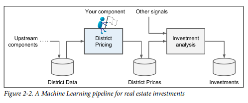
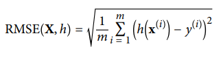
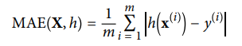
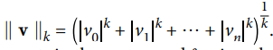
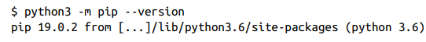
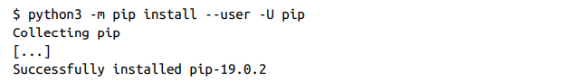
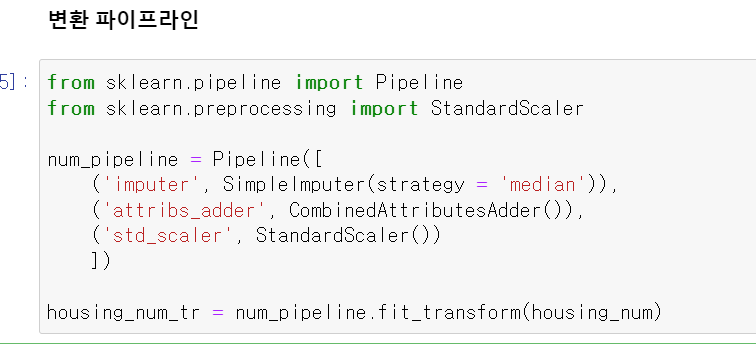
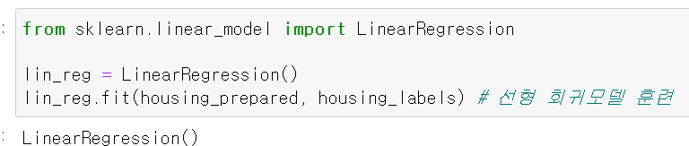
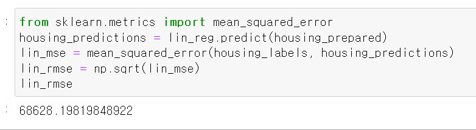
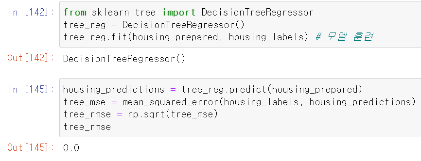

# 2 머신러닝 프로젝트 처음부터 끝까지

## 2.1 실제 데이터로 작업하기
- statLib 저장소의 캘리포니아 주택 가격(California Housing prices) 데이터 셋을 사용한다.
    - 1990년 캘리포니아 인구조사 데이터를 기반으로 함

## 2.2 큰 그림 보기
### 2.2.1 문제 정의
- 가장 먼저 비즈니스의 목적 정의하기
- 목적을 아는 것은 문제를 어떻게 구성할지, 어떤 알고리즘을 구성할지, 모델 평가에 어떤 성능 지표를 사용할지 등을 결정한다.

- 부동산 투자를 위한 머신러닝 파이프라인
    

- 파이프라인
    - 데이터 처리 컴포넌트들이 연속되어 있는 것을 데이터 파이프라인 이라고 한다.

- 그 다음으로는 현재 솔루션은 어떻게 구성되어있는지 파악하는 것이다.
- 현재 상황은 문제 해결 방법에 대한 정보는 물론, 참고 성능으로도 사용할 수 있다.
- 

### 2.2.2 성능 측정 지표 선택
- 회귀 문제의 전형적인 성능 지표는 평균 제곱근 오차(RMSE) 이다. 오차가 커질수록 이 값은 더욱 커지므로 예측에 얼마나 많은 오류가 있는지 가늠하게 해준다.
- RMSE 계산 공식
     
    - m : 데이터셋에 있는 샘플수
    - x(i) : 데이터셋에 있는 i번째 샘플(레이블을 제외한)의 전체 특성값의 벡터
    - y(i) : 해당 레이블
    - X : 데이터셋에 모든 샘플의 모든 특성값(레이블 제외)을 포함하는 행렬
    - h : 시스템의 예측 함수이며, 가설이라고 하고ㅡ y^ (i) = h(x(i))를 출력한다.

- RMSE는 일반적으로 회귀 문제에 선호되는 성능 측정 방법이고, 경우에 따라 다른 함수를 사용할 수 있는데, 예를 들어 이상치로 보이는 구역이 많다면 평균 절대 오차(MAE)를 고려해볼 수 있다.
- MAE 계산 공식

- RMSE와 MAE 모두 예측값의 벡터와 타깃값의 벡터 사이의 거리를 재는 방법이다.
- 거리를 측정하는 과정에는 여러가지 방법 (또는 norm)이 가능하다.
    - RMSE 계산은 Euclidean norm에 해당한다. 이는 L2 norm이라고도 부르며 |.|2로 표기한다.
    - 절댓값의 합을 계산하는 것은 L1 norm에 해당하며 |.|1로 표기하고, Manhatten norm이라고도 한다.
    - 원소가 n 개인 벡터 v인 Lk norm은   으로 정의하고, L0 norm은 단순히 벡터에 있는 0이 아닌 원소의 수이고, L∞는 벡터에서 가장 큰 절댓값을 의미한다.
    - norm의 지수가 클수록 큰 값의 원소에 치우치며 작은 값은 무시되므로, RMSE가 MAE보다 조금 더 이상치에 민감하다. 하지만 이상치가 매우 드물면 RMSE가 잘 맞아 일반적으로 많이 사용된다.

## 2.3 데이터 가져오기
### 2.3.1 작업 환경 만들기
- pip 패키지 버전확인

- pip 패키지 업그레이드 명령어

### 2.3.2 테스트 세트 만들기
- 알고리즘을 정하기 전과 데이터를 깊이 들여다 보기 전에 테스트 세트를 분리해야하는데, 이는 겉으로 들어난 테스트 세트의 패턴에 속아 ML model을 정하게 되면, 테스트 세트로 일반화 오차를 추정할 때 매우 낙관적인 추정이 되고, 시스템을 launching 했을 때 기대한 성능이 나오지 않을 것이다. 이를 데이터 스누핑(data snooping) 이라고 한다.

- 샘플링에서 테스트 세트가 전체 데이터를 대표하도록 각 계층에서 올바른 수의 샘플을 추출하는 것을 계층적 샘플링 이라고 한다.

- 완전한 무작위 샘플링을 사용하면 결과를 크게 편향시킬 수 있다.

- 계층을 나눌 때도 너무 많은 계층으로 나누면 안되고, 각 계층이 충분히 커야한다.

## 2.5 머신러닝 알고리즘을 위한 데이터 준비
- 머신러닝을 위해 데이터를 준비할 때 자동화 해야하는 이유
    - 어떤 데이터셋에도 데이터 변환을 손쉽게 반복할 수 있다.
    - 향후 프로젝트에 사용할 수 있는 변환 라이브러리를 점진적으로 구축하게 됨
    - 여러가지 데이터 변환을 쉽게 시도하게 되고, 어떤 조합이 가장 좋은지 확인하는데 편리함

### 2.5.1 데이터 정제 
- 누락된 특성 정제 방법
    1. 해당 구역 제거
    2. 전체 특성 삭제
    3. 어떤 값으로 채움(0, 평균, 중간값 등)

- 사이킷런의 SimpleImputer은 누락된 값을 손쉽게 다루도록 해준다.

#### 사이킷 런의 설계 원칙
- 일관성 : 모든 객체가 일관되고, 단순한 인터페이스를 공유한다.
    - 추정기(estimator) : 데이터셋을 기반으로 일련의 모델 파라미터들을 추정하는 객체를 추정기라고 한다. imputer 객체는 추정기이고, 추정 자체는 fit()에 의해 수행되고, 하나의 매개변수로 하나의 데이터셋만 전달한다.
    - 변환기(transformer) : imputer와 같이 데이터셋을 변환하는 추정기를 변환기라고 한다. 변환은 데이터셋을 매개변수로 전달받은 transform() 메서드가 수행하고, 변환된 데이터셋을 반환한다. 
    - 예측기(predictor) : 일부 추정기는 주어진 데이터셋에 대해 예측을 만들 수 있다. ( ex. LinearRegression 모델) 예측기의 predict()는 새로운 데이터셋을 받아 이에 상응하는 예측값을 반환한다.
- 검사 기능
- 클래스 남용 방지
- 조합성
- 합리적 기본값

### 2.5.2 텍스트와 범주형 특성 다루기
- 데이터 프레임에서 해당 column으로 접근할때 [] 로 접근하면 반환은 Series 형식이고, [[]]로 접근하면 반환은 pd.DataFrame 형식이다.
    
- 대부분의 머신러닝 알고리즘은 숫자를 다루므로 사이킷런의 OrdinalEncoder 클래스를 사용해서 텍스트에서 숫자로 변환한다.

### 2.5.3 나만의 변환기
- 사이킷런 기능 외에도 특별한 정제 작업이나 어떤 특성을 조합하는 등의 작업을 위해 자신만의 변환기를 만들어야 할 때가 있다.
- 내가 만든 변환기를 사이킷런의 기능과 매끄럽게 연동려면, 사이킷런은 상속이 아닌 덕 타이핑을 지원하므로 fit(), transform(), fit_transform() 메서드를 구현한 파이썬 클래스를 만들면 된다
    - 덕 타이핑 : 상속이나 인터페이스 구현이 아니라 객체의 속성이나 메서드가 객체의 유형을 결정하는 방식
- fit_transform() 메서드는 TransformerMixin을 상속하면 자동으로 생성된다.
    - 파이썬에서 Mixin이 있으면 객체의 기능을 확장하려는 목적으로 만들어진 클래스이다.
    - TransformerMixin은 fit_transform() 메서드 하나를 가지고 있으며 이를 상속하는 모든 파이썬 클래스에 이 메서드를 제공한다.
- 또한 BaseEstimator를 상속하면 하이퍼파라미터 튜닝에 필요한 두 메서드(get_params(), set_params()를 추가로 얻게된다.)

### 2.5.4 특성 스케일링
- 데이터에 적용할 가장 중요한 변환 중 하나는 특성 스케일링(feature scaling 이다.)
- 타깃값에 대한 스케링은 일반적으로 불필요하다.
- 모든 특성의 범위를 같도록 만들어주는 방법으로는 min-max 스케일링과 표준화가 널리 사용된다
- min-max 스케일링은 정규화라고 불리고, 0~1 범위에 들도록 값을 이동하고, 스케일을 조정하면 된다. (각 데이터에서 최솟값을 빼고, 최댓값과 최솟값의 차이로 나누는 방식) 사이킷런에서는 MinMaxScaler 변환기를 제공한다.

- 표준화는 먼저 평균을 뺀 후(표준화 결과가 항상 평균이 0이 되는 이유) 표준편차로 나누어 결과 분포의 분산이 1이 되도록 한다.
- min-max 스케일링과는 달리 표준화는 범위의 상한과 하한이 없어 주로 0~1을 원하는 신경망에서는 문제가 될 수 있지만, 표준화는 이상치의 영향을 덜 받는다. 사이킷런에서는 표준화를 위해 StandardScaler 변환기를 제공한다.

### 2.5.5 변환 파이프라인 
- 변환 단계는 많고 정확한 순서대로 실행되어야 한다. 사이킷런에서는 연속된 변환을 순서대로 처리할 수 있도록 도와주는 Pipeline 클래스가 있다.
    - 예시
    

- Pipeline은 연속된 단계를  나타내는 이름/추정기 쌍의 목록을 입력으로 받는다. 마지막 단계에는 변환기와 추정기를 모두 사용할 수 있고, 그 외에는 모두 변환기여야 한다.
- Pipeline의 fit() 메서드를 호출하면, 모든 변환기의 fit_transform() 메서드를 순서대로 호출하면서 한 단계의 출력을 다음 단계의 입력으로 전달한다. 마지막 단계에서는 fit 메서드만 출력한다.
- Pipeline의 객체는 마지막 추정기와 동일한 메서드를 제공하는데, 이 예시에서는 마지막 추정기가 변환기 StandardScaler 이므로 파이프라인이 데이터에 대해 모든 변환을 순서대로 적용하는 transform() 메서드를 가지고 있다.

- 하나의 변환기로 각 열마다 적절한 변환을 적용하여 모든 열을 처리하는 기능을 위해 'ColumnTransformer'가 추가되었다.

## 2.6 모델 선택과 훈련 
### 2.6.1 훈련 세트에서 훈련하고 평가하기
- 선형 회귀 모델 학습 및 예측과 RMSE 측정
    
    - 중간 주택 가격 범위가 120,000~265,000 인 점을 감안할 때 RMSE가 68.628은 결과가 좋지 못함
    - 모델이 훈련 데이터에 과소적합된 사례로 볼 수 있어, 강력한 모델을 선정하거나, 훈련 알고리즘에 더 좋은 특성을 주입하거나, 모델의 규제를 감소시켜 해결한다.

- 강력하고 데이터에서 복잡한 비선형 관계를 찾을 수 있는 DecisionTreeRegressor
    
    - 오차가 0인 것을 봤을때 모델이 데이터에 너무 심하게 과대적합된 것으로 볼 수 있다.

### 2.6.2 교차 검증을 사용한 평가
- 사이킷런의 k-fold cross validation 기능으로 결정 트리 모델을 평가 할 수 있다.
- 훈련세트를 fold개의 서브셋으로 무작위로 분할하고, 그 다음 결정 트리 모델을 fold 번 훈련하고, 평가하는데 매번 다른 폴드를 선택해 평가에 사용되고 나머지 9개 fold는 훈련에 사용된다. 그 결과 10개의 평가 점수가 담긴 배열이 결과가 된다.

## 2.7 모델 세부 튜닝
### 2.7.1 그리드 탐색
- 모델을 세부 튜닝하면서 만족할 만한 하이퍼파라미터 조합을 수동으로 찾는 것 대신 사이킷런의 GridSearchCV를 사용하는 것이 좋다.
- 이는 탐색하고자 하는 하이퍼파라미터와 시도해볼 값을 지정하기만 하면 되고, 그러면 가능한 모든 하이퍼파라미터 조합에 대해 교차 검증을 사용해 평가한다.

### 2.7.2 랜덤 탐색
- 그리드 탐색 방법은 비교적 적은 수의 조합을 탐구할 때 괜찮다. 하지만 하이퍼파라미터 탐색 공간이 커지면 RandomizedSearchCV를 사용하는 것이 좋다.
- RandomizedSearchCV는 GridSearchCV와 거의 같은 방식으로 사용하지만 가능한 모든 조합을 시도하는 대신 각 반복마다 하이퍼파라미터에 임의의 수를 대입하여 지정한 횟수만큼 평가한다.

